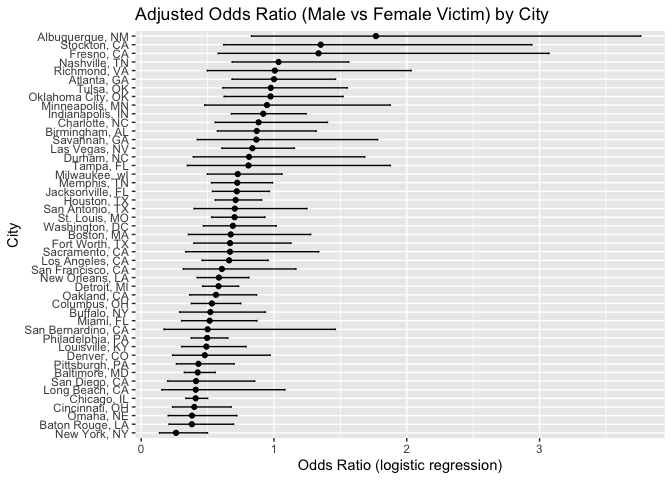
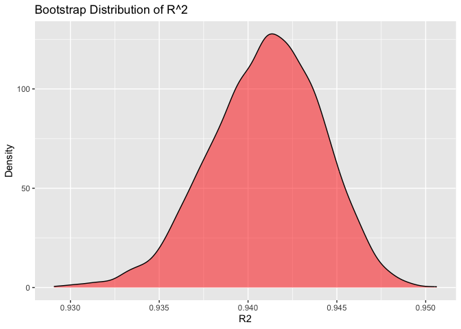
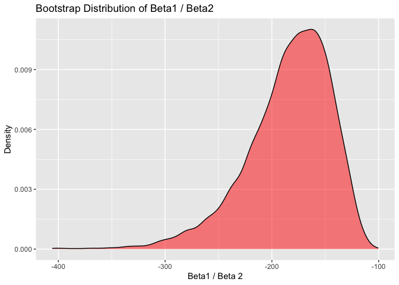
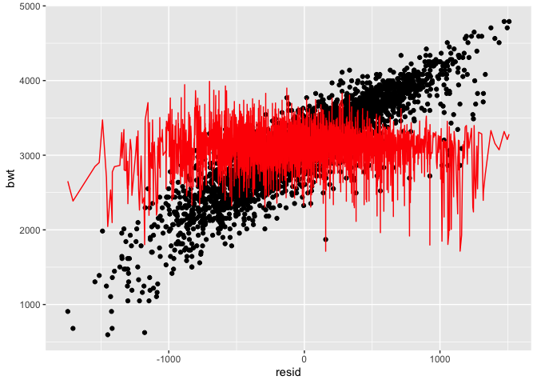
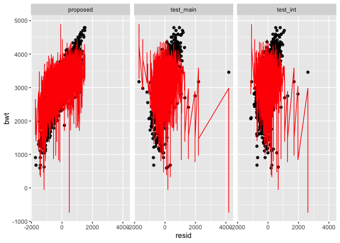
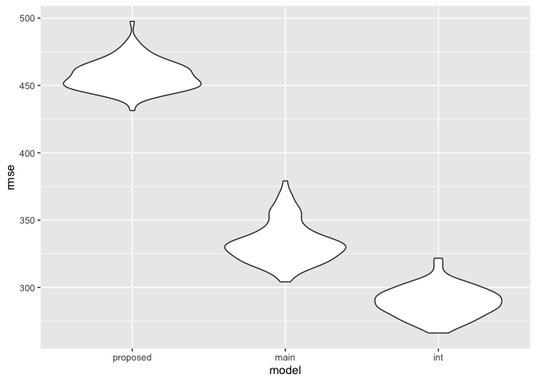

p8105_hw6_ecw2178
================
2025-12-03

``` r
library(tidyverse)
```

    ## ── Attaching core tidyverse packages ──────────────────────── tidyverse 2.0.0 ──
    ## ✔ dplyr     1.1.4     ✔ readr     2.1.5
    ## ✔ forcats   1.0.1     ✔ stringr   1.5.2
    ## ✔ ggplot2   4.0.0     ✔ tibble    3.3.0
    ## ✔ lubridate 1.9.4     ✔ tidyr     1.3.1
    ## ✔ purrr     1.1.0     
    ## ── Conflicts ────────────────────────────────────────── tidyverse_conflicts() ──
    ## ✖ dplyr::filter() masks stats::filter()
    ## ✖ dplyr::lag()    masks stats::lag()
    ## ℹ Use the conflicted package (<http://conflicted.r-lib.org/>) to force all conflicts to become errors

``` r
library(p8105.datasets)
library(modelr)
library(mgcv)
```

    ## Loading required package: nlme
    ## 
    ## Attaching package: 'nlme'
    ## 
    ## The following object is masked from 'package:dplyr':
    ## 
    ##     collapse
    ## 
    ## This is mgcv 1.9-3. For overview type 'help("mgcv-package")'.

### Problem 1

``` r
homicides_raw = read_csv("data/homicide-data.csv")
```

    ## Rows: 52179 Columns: 12
    ## ── Column specification ────────────────────────────────────────────────────────
    ## Delimiter: ","
    ## chr (9): uid, victim_last, victim_first, victim_race, victim_age, victim_sex...
    ## dbl (3): reported_date, lat, lon
    ## 
    ## ℹ Use `spec()` to retrieve the full column specification for this data.
    ## ℹ Specify the column types or set `show_col_types = FALSE` to quiet this message.

``` r
homicides = homicides_raw %>% 
  janitor::clean_names() %>%
  mutate(city_state = paste(city, state, sep = ", ")) %>% 
  filter(!city_state %in% c("Dallas, TX", "Phoenix, AZ", "Kansas City, MO", "Tulsa, AL")) %>% 
  filter(victim_race %in% c("Black", "White")) %>% 
  mutate(resolved = as.numeric(disposition == "Closed by arrest"),
         victim_age = as.numeric(victim_age),
         victim_race = fct_relevel(victim_race, "White"),
         victim_sex = fct_relevel(victim_sex, "Female"))
```

    ## Warning: There was 1 warning in `mutate()`.
    ## ℹ In argument: `victim_age = as.numeric(victim_age)`.
    ## Caused by warning:
    ## ! NAs introduced by coercion

``` r
baltimore_homicides = homicides %>% 
  filter(city_state == "Baltimore, MD")

baltimore_logit = glm(resolved ~ victim_age + victim_race + victim_sex, data = baltimore_homicides, family = binomial()) %>%
  broom::tidy() 

baltimore_OR = baltimore_logit %>% 
  mutate(OR = exp(c(estimate)), 
         AdjSE = exp(c(std.error))) %>% 
  select(term, log_OR = estimate, OR, std.error, AdjSE, p.value) %>% 
  knitr::kable(digits = 3)
```

The adjusted odds ratio for solving homicides comparing male victims to
female victims keeping all other variables fixed is 0.426.

``` r
city_states = unique(homicides$city_state)

resolved_OR = function(city_state_input){
  city_homicides = homicides %>% 
    filter(city_state == city_state_input)
  
  city_logit = glm(resolved ~ victim_age + victim_race + victim_sex, data = city_homicides, family = binomial()) %>% 
    broom::tidy() 
  
  city_OR = city_logit %>% 
    mutate(OR = exp(estimate),
           AdjSE = exp(std.error)) %>% 
    select(term, log_OR = estimate, OR, std.error, AdjSE, p.value) 

  return(tibble(
    Term = city_OR$term,
    Estimate = city_OR$OR,
    CI = city_OR$AdjSE
  ))
}

city_state_OR = 
  tibble(all_cities = city_states) %>% 
  mutate(results = map(all_cities, resolved_OR))

unnest_city_state_OR = 
  city_state_OR %>% 
  unnest(results)

# Does the same thing! 

national_city_homicides_male = homicides %>% 
  nest(city_homicides = -city_state) %>% 
  mutate(
    cities_logit = map(city_homicides, 
                       ~ glm(resolved ~ victim_age + victim_race + victim_sex, 
                             data = .x, family = binomial())),
    results = map(cities_logit, 
                  ~ broom::tidy(.x) %>% 
                    mutate(
                      OR = exp(estimate),
                      lower_CI = exp(estimate - 1.96 * std.error),
                      upper_CI = exp(estimate + 1.96 * std.error)
                    ) %>% 
                    select(term, estimate, std.error, OR, lower_CI, upper_CI))
  ) %>% 
  select(city_state, results) %>% 
  unnest(results) %>% 
  filter(term == "victim_sexMale")


#### Need to create plot and fix CI - plots needs to be saved and put in folders
```

``` r
national_city_homicides_male %>% 
  arrange(OR) %>% 
  mutate(city_state = fct_inorder(city_state)) %>% 
  ggplot(aes(x = city_state, y = OR)) +
  geom_point() +
  geom_errorbar(aes(ymin = lower_CI, ymax = upper_CI), width = 0.2) +
  coord_flip() +
  labs(
    title = "Adjusted Odds Ratio (Male vs Female Victim) by City",
    y = "Odds Ratio (logistic regression)",
    x = "City"
  )
```

<!-- -->
The highest estimate (OD \> 1) of the adjusted odds ratio for solving
homicides comparing male victims to female victims keeping all other
variables fixed is Albuquerque, NM, Stockton, CA, and Fresno, CA. These
cities also have higher confidence intervals for the same term estimate
compared to the rest. This is in contrast to cities like Baton Rouge, LA
and New York, NY, which have low estimates (OD \< 1) of the adjusted
odds ratio for solving homicides comparing male victims to female
victims as well as low confidence intervals keeping all other variables
fixed.

### Problem 2

``` r
data("weather_df")

weather_test = lm(tmax ~ tmin + prcp, data = weather_df)

test_rsquared = weather_test %>% 
  broom::glance() %>% 
  select(r.squared)

test_betas = weather_test %>% 
  broom::tidy() %>% 
  filter(term %in% c("tmin", "prcp")) %>%
  select(term, estimate) %>%
  pivot_wider(names_from = term, values_from = estimate) %>% 
  mutate(predictors_divided = tmin/prcp)

test_results = tibble(
  rsquared = test_rsquared$r.squared,
  betas_div = test_betas$predictors_divided
)


boot_sample = function(df) {
  df_sample = sample_frac(df, replace = TRUE)
  
  weather_test = lm(tmax ~ tmin + prcp, data = df_sample)

  test_rsquared = weather_test %>% 
    broom::glance() %>% 
    select(r.squared)
  
  test_betas = weather_test %>% 
    broom::tidy() %>% 
    filter(term %in% c("tmin", "prcp")) %>%
    select(term, estimate) %>%
    pivot_wider(names_from = term, values_from = estimate) %>% 
    mutate(predictors_divided = tmin/prcp)
  
  return(tibble(
    rsquared = test_rsquared$r.squared,
    betas_div = test_betas$predictors_divided
  ))
}

boot_straps = 
  tibble(strap_number = 1:5000) %>% 
  mutate(
    strap_sample = map(strap_number, \(i) boot_sample(df = weather_df))
  ) %>% 
  unnest(strap_sample)
```

``` r
#### Plot and find confidence intervals- plots needs to be saved and put in folders
r2_CI = quantile(boot_straps$rsquared, c(0.025, 0.975))
r2_CI
```

    ##      2.5%     97.5% 
    ## 0.9345494 0.9466315

``` r
boot_straps %>%
  ggplot(aes(x = rsquared)) +
  geom_density(fill = "red", alpha = 0.5) +
  labs(
    title = "Bootstrap Distribution of R^2",
    x = "R2",
    y = "Density"
  )
```

<!-- -->

``` r
beta_ratio_CI = quantile(boot_straps$betas_div, c(0.025, 0.975))
beta_ratio_CI
```

    ##      2.5%     97.5% 
    ## -280.5268 -126.4515

``` r
boot_straps %>%
  ggplot(aes(x = betas_div)) +
  geom_density(fill = "red", alpha = 0.5) +
  labs(
    title = "Bootstrap Distribution of Beta1 / Beta2",
    x = "Beta1 / Beta 2",
    y = "Density"
  )
```

<!-- -->

### Problem 3

``` r
birthweight_raw = read_csv("data/birthweight.csv")
```

    ## Rows: 4342 Columns: 20
    ## ── Column specification ────────────────────────────────────────────────────────
    ## Delimiter: ","
    ## dbl (20): babysex, bhead, blength, bwt, delwt, fincome, frace, gaweeks, malf...
    ## 
    ## ℹ Use `spec()` to retrieve the full column specification for this data.
    ## ℹ Specify the column types or set `show_col_types = FALSE` to quiet this message.

``` r
str(birthweight_raw)
```

    ## spc_tbl_ [4,342 × 20] (S3: spec_tbl_df/tbl_df/tbl/data.frame)
    ##  $ babysex : num [1:4342] 2 1 2 1 2 1 2 2 1 1 ...
    ##  $ bhead   : num [1:4342] 34 34 36 34 34 33 33 33 36 33 ...
    ##  $ blength : num [1:4342] 51 48 50 52 52 52 46 49 52 50 ...
    ##  $ bwt     : num [1:4342] 3629 3062 3345 3062 3374 ...
    ##  $ delwt   : num [1:4342] 177 156 148 157 156 129 126 140 146 169 ...
    ##  $ fincome : num [1:4342] 35 65 85 55 5 55 96 5 85 75 ...
    ##  $ frace   : num [1:4342] 1 2 1 1 1 1 2 1 1 2 ...
    ##  $ gaweeks : num [1:4342] 39.9 25.9 39.9 40 41.6 ...
    ##  $ malform : num [1:4342] 0 0 0 0 0 0 0 0 0 0 ...
    ##  $ menarche: num [1:4342] 13 14 12 14 13 12 14 12 11 12 ...
    ##  $ mheight : num [1:4342] 63 65 64 64 66 66 72 62 61 64 ...
    ##  $ momage  : num [1:4342] 36 25 29 18 20 23 29 19 13 19 ...
    ##  $ mrace   : num [1:4342] 1 2 1 1 1 1 2 1 1 2 ...
    ##  $ parity  : num [1:4342] 3 0 0 0 0 0 0 0 0 0 ...
    ##  $ pnumlbw : num [1:4342] 0 0 0 0 0 0 0 0 0 0 ...
    ##  $ pnumsga : num [1:4342] 0 0 0 0 0 0 0 0 0 0 ...
    ##  $ ppbmi   : num [1:4342] 26.3 21.3 23.6 21.8 21 ...
    ##  $ ppwt    : num [1:4342] 148 128 137 127 130 115 105 119 105 145 ...
    ##  $ smoken  : num [1:4342] 0 0 1 10 1 0 0 0 0 4 ...
    ##  $ wtgain  : num [1:4342] 29 28 11 30 26 14 21 21 41 24 ...
    ##  - attr(*, "spec")=
    ##   .. cols(
    ##   ..   babysex = col_double(),
    ##   ..   bhead = col_double(),
    ##   ..   blength = col_double(),
    ##   ..   bwt = col_double(),
    ##   ..   delwt = col_double(),
    ##   ..   fincome = col_double(),
    ##   ..   frace = col_double(),
    ##   ..   gaweeks = col_double(),
    ##   ..   malform = col_double(),
    ##   ..   menarche = col_double(),
    ##   ..   mheight = col_double(),
    ##   ..   momage = col_double(),
    ##   ..   mrace = col_double(),
    ##   ..   parity = col_double(),
    ##   ..   pnumlbw = col_double(),
    ##   ..   pnumsga = col_double(),
    ##   ..   ppbmi = col_double(),
    ##   ..   ppwt = col_double(),
    ##   ..   smoken = col_double(),
    ##   ..   wtgain = col_double()
    ##   .. )
    ##  - attr(*, "problems")=<externalptr>

``` r
# Is race an ordered factor here? Does it matter? 

birthweight = birthweight_raw %>% 
  janitor::clean_names() %>%
  mutate(babysex = recode(babysex, "1" = "male", "2" = "female"),
         frace = recode(frace, "1" = "White",
                      "2" = "Black",
                      "3" = "Asian",
                      "4" = "Puerto Rican",
                      "8" = "Other",
                      "9" = "Unknown"),
         malform = recode(malform, "0" = "absent", "1" = "present"),
         mrace = recode(mrace, "1" = "White",
                      "2" = "Black",
                      "3" = "Asian",
                      "4" = "Puerto Rican",
                      "8" = "Other")) %>%
  mutate(babysex = factor(babysex, levels = c("male", "female"), ordered = TRUE),
         frace = fct_infreq(frace),
         mrace = fct_infreq(mrace),
         malform = factor(malform, levels = c("absent", "1" = "present"), ordered = TRUE))

str(birthweight)
```

    ## tibble [4,342 × 20] (S3: tbl_df/tbl/data.frame)
    ##  $ babysex : Ord.factor w/ 2 levels "male"<"female": 2 1 2 1 2 1 2 2 1 1 ...
    ##  $ bhead   : num [1:4342] 34 34 36 34 34 33 33 33 36 33 ...
    ##  $ blength : num [1:4342] 51 48 50 52 52 52 46 49 52 50 ...
    ##  $ bwt     : num [1:4342] 3629 3062 3345 3062 3374 ...
    ##  $ delwt   : num [1:4342] 177 156 148 157 156 129 126 140 146 169 ...
    ##  $ fincome : num [1:4342] 35 65 85 55 5 55 96 5 85 75 ...
    ##  $ frace   : Factor w/ 5 levels "White","Black",..: 1 2 1 1 1 1 2 1 1 2 ...
    ##  $ gaweeks : num [1:4342] 39.9 25.9 39.9 40 41.6 ...
    ##  $ malform : Ord.factor w/ 2 levels "absent"<"present": 1 1 1 1 1 1 1 1 1 1 ...
    ##  $ menarche: num [1:4342] 13 14 12 14 13 12 14 12 11 12 ...
    ##  $ mheight : num [1:4342] 63 65 64 64 66 66 72 62 61 64 ...
    ##  $ momage  : num [1:4342] 36 25 29 18 20 23 29 19 13 19 ...
    ##  $ mrace   : Factor w/ 4 levels "White","Black",..: 1 2 1 1 1 1 2 1 1 2 ...
    ##  $ parity  : num [1:4342] 3 0 0 0 0 0 0 0 0 0 ...
    ##  $ pnumlbw : num [1:4342] 0 0 0 0 0 0 0 0 0 0 ...
    ##  $ pnumsga : num [1:4342] 0 0 0 0 0 0 0 0 0 0 ...
    ##  $ ppbmi   : num [1:4342] 26.3 21.3 23.6 21.8 21 ...
    ##  $ ppwt    : num [1:4342] 148 128 137 127 130 115 105 119 105 145 ...
    ##  $ smoken  : num [1:4342] 0 0 1 10 1 0 0 0 0 4 ...
    ##  $ wtgain  : num [1:4342] 29 28 11 30 26 14 21 21 41 24 ...

``` r
proposed = lm(bwt ~ wtgain + gaweeks, data = birthweight) 

birthweight %>%
  add_predictions(proposed) %>% 
  add_residuals(proposed) %>% 
  ggplot(aes(x = resid, y = bwt)) + 
  geom_point() + 
  geom_line(aes(y = pred), color = "red")
```

<!-- -->

The proposed model attempts to find predictors for baby birthweight
while trying to keep the most parsimonious model. Related variables were
avoided to avoid colinearity. Additionally, variables were chosen to
only include factors that could affect the birthweight before the baby
was born; variables such as baby head circumference and length at birth
wouldn’t make sense as predictors.

``` r
test_main = lm(bwt ~ blength + gaweeks, data = birthweight)
test_int = lm(bwt ~ bhead + blength + babysex + 
                bhead*blength + bhead*babysex + blength*babysex + 
                bhead*blength*babysex, data = birthweight)
```

``` r
birthweight %>% 
  gather_predictions(proposed, test_main, test_int) %>% 
  gather_residuals(proposed, test_main, test_int) %>% 
  mutate(model = fct_inorder(model)) %>% 
  ggplot(aes(x = resid, y = bwt)) +
  geom_point(alpha = .5) +
  geom_line(aes(y = pred), color = "red") + 
  facet_grid(~model)
```

<!-- -->

``` r
cv = crossv_mc(birthweight, 100) %>% 
  mutate(
    train = map(train, as_tibble),
    test = map(test, as_tibble))

cv = cv %>%
  mutate(
    mod_proposed = map(train, ~ lm(bwt ~ wtgain + gaweeks, data = .x)),
    mod_main     = map(train, ~ lm(bwt ~ blength + gaweeks, data = .x)),
    mod_int      = map(train, ~ lm(bwt ~ bhead * blength * babysex, data = .x))
  ) %>% 
  mutate(
    rmse_proposed = map2_dbl(mod_proposed, test, ~ rmse(model = .x, data = .y)),
    rmse_main     = map2_dbl(mod_main,     test, ~ rmse(model = .x, data = .y)),
    rmse_int      = map2_dbl(mod_int,      test, ~ rmse(model = .x, data = .y))
  )
```

``` r
cv_plot = cv %>%
  select(starts_with("rmse_")) %>%
  pivot_longer(
    everything(),
    names_to = "model",
    values_to = "rmse",
    names_prefix = "rmse_"
  ) %>%
  mutate(model = fct_inorder(model))

cv_plot %>% 
  ggplot(aes(x = model, y = rmse)) +
  geom_violin()
```

<!-- -->
